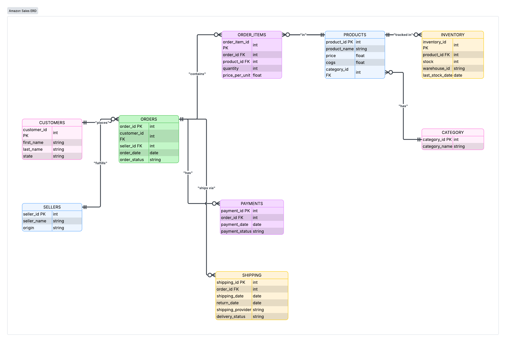
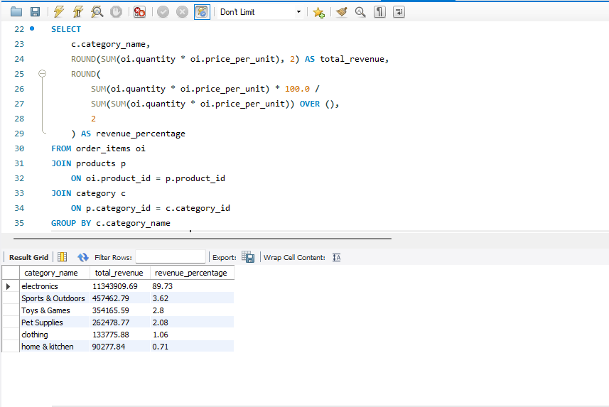
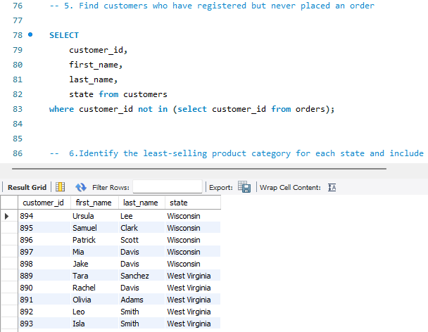
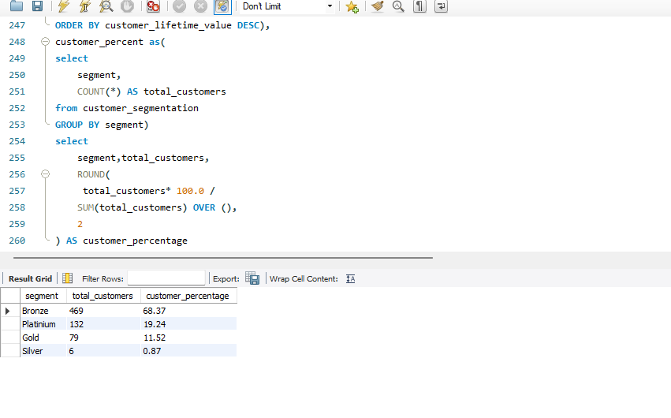
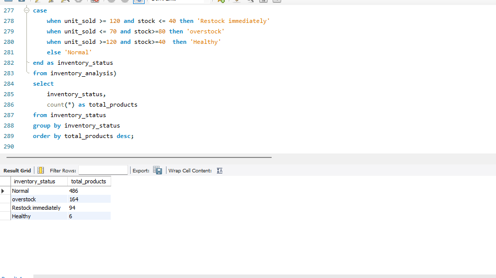

# 🛒 Amazon E-Commerce SQL Analytics Project

## 📌 Project Overview

This project analyzes an Amazon e-commerce database using MySQL to solve real-world business problems through SQL.

The project includes:

- Data Cleaning
- Database Design
- Business KPIs
- Customer Analytics
- Revenue Analysis
- Inventory Analysis
- Return Analysis
- Window Functions
- Common Table Expressions (CTEs)
- Stored Procedures
- Index Optimization

---

## 🛠 Tools Used

- MySQL Workbench
- SQL
- Excel
- GitHub

---

## 📂 Database Tables

- Customers
- Orders
- Order Items
- Products
- Inventory
- Shipping
- Payments
- Sellers

---

## 📊 Business Problems Solved

✔ Total Revenue

✔ Customer Lifetime Value (CLTV)

✔ Average Order Value

✔ Top Selling Products

✔ Bottom Selling Products

✔ Inventory Risk Analysis

✔ Product Return Analysis

✔ Payment Success Rate

✔ Warehouse Stock Analysis

✔ Category Revenue Contribution

✔ Customer Purchase Behaviour

✔ Monthly Sales Trend

---

## 🧹 Data Cleaning

- Removed duplicate records
- Checked NULL values
- Validated data types
- Standardized return dates
- Verified foreign keys
- Cleaned inconsistent values

---

## 📈 SQL Concepts Used

- Joins
- Aggregate Functions
- CASE WHEN
- GROUP BY
- HAVING
- Window Functions
- CTEs
- Subqueries

---

## 🖼 Database Schema

---

## 📷 Project Screenshots

### Revenue Analysis

### Customer Analysis

### Inventory Analysis

---

## 🚀 Key Insights

- Identified top-performing products.
- Measured customer lifetime value.
- Detected inventory shortages.
- Analyzed successful payment rate.
- Compared warehouse stock distribution.
- Generated category-wise revenue insights.

---

## 👩‍💻 Author

**Vaishnavi Sarode**

SQL • Excel • Data Analytics 
